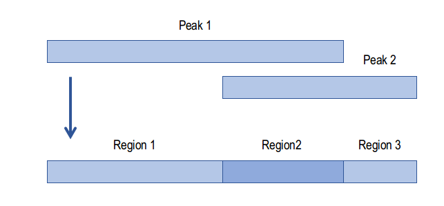

# ChIP-seq processing

Here, you can find a detailed description of how ChIP-seq data was processed in this project.

## Dependencies

* [Trim Galore](https://github.com/FelixKrueger/TrimGalore)
* [FastQC](https://www.bioinformatics.babraham.ac.uk/projects/fastqc/)
* [Bowtie2](https://bowtie-bio.sourceforge.net/bowtie2/index.shtml)
* [samtools](http://www.htslib.org/download/)
* [sambamba](https://github.com/biod/sambamba)
* [deepTools](https://deeptools.readthedocs.io/en/latest/)
* [macs2](https://github.com/macs3-project/MACS)
* [csaw (R package)](https://bioconductor.org/packages/release/bioc/html/csaw.html)
* [GenomicRanges (R package)](https://bioconductor.org/packages/release/bioc/html/GenomicRanges.html)
* [DESeq2 (R package)](https://bioconductor.org/packages/release/bioc/html/DESeq2.html)


## Summary of the workflow

1. **Trimming and Quality**: Trim Galore and FastQC
2. **Alignment**: Bowtie2
3. **Filtering**: samtools and sambamba
4. **Coverage**: deepTools
5. **Peak Calling**: Macs2
6. **Generating Peakmatrix**: csaw and GenomicRanges
7. **Generating Background Matrix**: csaw and GenomicRanges
8. **Differential Analysis**: DESeq2


A detailed description of how steps 1-4 were performed can be found [here](https://github.com/JavierreLab/liCHiC/tree/main/3.ChIPseq%20Processing), the github page associated to Tomás-Daza, L *et al.* Low input capture Hi-C (liCHi-C) identifies promoter-enhancer interactions at high-resolution. *Nature Communications* **14**, 268 (2023). [https://doi.org/10.1038/s41467-023-35911-8](https://doi.org/10.1038/s41467-023-35911-8)

## 5. Peak Calling

This step computes significants peaks detected in the experiment. Different variations used in this project are shown below.
```{bash}
# Calling peaks in default (narrow) mode for histone mark H3K27ac.
macs2 callpeak -t $BAM -f $FORMAT -c $BAMINPUT -g $ORG -B -n ${PREFIX} --outdir $OUTDIR/peaks

# Calling peaks in broad mode for histone mark H3K27ac.
macs2 callpeak --broad -t $BAM -f $FORMAT -c $BAMINPUT -g $ORG -B -n ${PREFIX} --outdir $OUTDIR/peaks

# Calling merge/consensus peaks for one sample with many replicates
macs2 callpeak -f $FORMAT -t $BAM1 $BAM2 $BAM3  -c $BAMINPUT1 $BAMINPUT2 $BAMINPUT3  -g $ORG -B -n ${PREFIX} --outdir $OUTDIR/peaks
```

## 6. Generating Peakmatrix
This step allows us to generate a peakmatrix of all our samples. By doing this, we can quantify and compare peaks between samples.

### a. Choose samples of interest
For this, you need to have a complete vector of paths to your sample's bam files (obtained afters step 3) and corresponding peak files (obtained after step 5)
```{r}
library(csaw)
library(GenomicRanges)
library(tidyverse)

path_bams <- arg[1] # list of paths to your bam files of interest
path_peaks <- arg[2] # list of paths to your corresponding peak files of interest
```
### b. Read in peaks
Here, you read all peak files and generate one object with the complete list of all significant peaks found in all samples of interest
```{r}
# read in peak files, covert to GRanges objects
peaks <- GRanges()
for (i in peak_files) 
{
  a <- data.table::fread(i)[,1:4]
  aGR <- makeGRangesFromDataFrame(a, seqnames.field = "V1", start.field = "V2", end.field = "V3", keep.extra.columns = T)
  peaks <- c(peaks, aGR)
}
colnames(elementMetadata(peaks)) <- "name"
peaks$ID <- 1:length(peaks)
```

### c. Disjoin peaks
The next step is to perform a disjoin of the peaks. This means that two overlapping peaks are split into three regions, with region 1 corresponding to the region unique to peak1, regions 2 being the region where both peaks overlap, and region 2 correspoing to the region unique to peak3. The figure below illustrates this.



```{r}
# disjoin peaks
peak_disj <- disjoin(peaks,with.revmap=T)
```


```{r}
# count reads falling in each region of peak_disj for each sample in bam_files
param <- readParam()
peak_count <- regionCounts(bam.files = bam_files, regions = peak_disj,
                           ext = NA, param = param, 
                           BPPARAM = BatchtoolsParam(workers = length(bam_files)*2))     
peak_df <- as.data.frame(assay(peak_count))
colnames(peak_df) <- colData(peak_count)$bam.files
peak_df$region <- paste(seqnames(rowRanges(peak_count)),ranges(rowRanges(peak_count)), sep = ":")
data.table::fwrite(peak_df[,c(ncol(peak_df),1:(ncol(peak_df)-1))], file=paste0(out_dir,"/peak_matrix_counts.tsv"), row.names = F, col.names = T, quote = F, sep = "\t")
```

End with an example of getting some data out of the system or using it for a little demo

## Running the tests

Explain how to run the automated tests for this system

### Break down into end to end tests

Explain what these tests test and why

```
Give an example
```

### And coding style tests

Explain what these tests test and why

```
Give an example
```

## Deployment

Add additional notes about how to deploy this on a live system

## Built With

* [Dropwizard](http://www.dropwizard.io/1.0.2/docs/) - The web framework used
* [Maven](https://maven.apache.org/) - Dependency Management
* [ROME](https://rometools.github.io/rome/) - Used to generate RSS Feeds

## Contributing

Please read [CONTRIBUTING.md](https://gist.github.com/PurpleBooth/b24679402957c63ec426) for details on our code of conduct, and the process for submitting pull requests to us.

## Versioning

We use [SemVer](http://semver.org/) for versioning. For the versions available, see the [tags on this repository](https://github.com/your/project/tags). 

## Authors

* **Billie Thompson** - *Initial work* - [PurpleBooth](https://github.com/PurpleBooth)

See also the list of [contributors](https://github.com/your/project/contributors) who participated in this project.

## License

This project is licensed under the MIT License - see the [LICENSE.md](LICENSE.md) file for details

## Acknowledgments

* Hat tip to anyone whose code was used
* Inspiration
* etc

